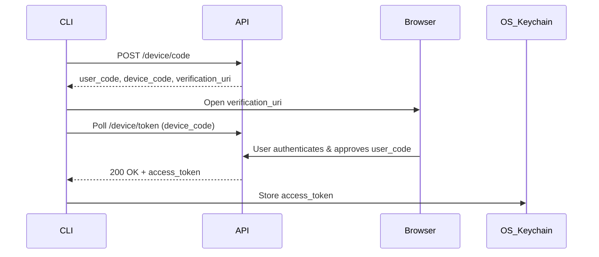

# Derivo Authentication & Identity Architecture (Phase 2)

**Status:** Approved  
**Author:** Staff Security Engineer & Principal Architect  
**Scope:** Authentication, Identity, Sessions, Security & Trial Architecture

This document defines the complete identity and security blueprint for Derivo. It leverages [Better Auth](https://better-auth.com/) as the core authentication framework, PostgreSQL (via Drizzle) for state, and Firebase for OTP-based trial verification.

---

## 1. Updated Authentication Architecture

Derivo implements a unified Identity and Access Management (IAM) system using **Better Auth**.

- **Primary Framework:** Better Auth (handles Sessions, OAuth, Email Login, Password Reset, Verification).
- **Authentication Methods:**
  1. Email + Password (Argon2id hashing)
  2. Google OAuth
  3. GitHub OAuth
- **Account Linking:** Strict "Single Identity" policy. If a user signs up with Google and later with GitHub using the same email, the accounts are linked. No duplicate `User` records.
- **Trial Verification:** Firebase Authentication is used **only** for sending/verifying SMS OTPs to activate the 7-Day Pro Trial. It is completely decoupled from the main IAM login flow.

---

## 2. Better Auth Configuration

The Better Auth instance runs on the `apps/api` (or Next.js API routes) and exposes standard endpoints (`/api/auth/*`).

```typescript
import { betterAuth } from "better-auth";
import { drizzleAdapter } from "better-auth/adapters/drizzle";
import { db } from "@derivo/db";
import { argon2id } from "better-auth/plugins";

export const auth = betterAuth({
  database: drizzleAdapter(db, {
    provider: "pg"
  }),
  emailAndPassword: {
    enabled: true,
    passwordHashing: argon2id(),
    sendResetPassword: async (data, request) => { /* send email */ },
    sendVerificationEmail: async (data, request) => { /* send email */ }
  },
  socialProviders: {
    google: {
      clientId: process.env.GOOGLE_CLIENT_ID,
      clientSecret: process.env.GOOGLE_CLIENT_SECRET,
    },
    github: {
      clientId: process.env.GITHUB_CLIENT_ID,
      clientSecret: process.env.GITHUB_CLIENT_SECRET,
    }
  },
  account: {
    accountLinking: {
      enabled: true,
      trustedProviders: ["google", "github"]
    }
  },
  session: {
    expiresIn: "7d",
    updateAge: "1d",
  }
});
```

---

## 3. OAuth Provider Configuration

- **Google OAuth:**
  - Scopes: `openid`, `email`, `profile`
  - Redirect URI: `https://app.derivo.dev/api/auth/callback/google`
- **GitHub OAuth:**
  - Scopes: `read:user`, `user:email`
  - Redirect URI: `https://app.derivo.dev/api/auth/callback/github`

---

## 4. Database Schema (Drizzle ORM)

```typescript
// Users & Accounts (Better Auth compliant)
export const users = pgTable("user", {
  id: text("id").primaryKey(),
  name: text("name").notNull(),
  email: text("email").notNull().unique(),
  emailVerified: boolean("emailVerified").notNull(),
  image: text("image"),
  role: text("role").default("community"),
  createdAt: timestamp("createdAt").notNull().defaultNow(),
  updatedAt: timestamp("updatedAt").notNull().defaultNow()
});

export const accounts = pgTable("account", {
  id: text("id").primaryKey(),
  accountId: text("accountId").notNull(),
  providerId: text("providerId").notNull(),
  userId: text("userId").notNull().references(() => users.id),
  accessToken: text("accessToken"),
  refreshToken: text("refreshToken"),
  idToken: text("idToken"),
  accessTokenExpiresAt: timestamp("accessTokenExpiresAt"),
  refreshTokenExpiresAt: timestamp("refreshTokenExpiresAt"),
  scope: text("scope"),
  password: text("password"),
  createdAt: timestamp("createdAt").notNull().defaultNow(),
  updatedAt: timestamp("updatedAt").notNull().defaultNow()
});

export const sessions = pgTable("session", {
  id: text("id").primaryKey(),
  expiresAt: timestamp("expiresAt").notNull(),
  token: text("token").notNull().unique(),
  createdAt: timestamp("createdAt").notNull().defaultNow(),
  updatedAt: timestamp("updatedAt").notNull().defaultNow(),
  ipAddress: text("ipAddress"),
  userAgent: text("userAgent"),
  userId: text("userId").notNull().references(() => users.id)
});

export const verifications = pgTable("verification", {
  id: text("id").primaryKey(),
  identifier: text("identifier").notNull(),
  value: text("value").notNull(),
  expiresAt: timestamp("expiresAt").notNull(),
  createdAt: timestamp("createdAt").defaultNow(),
  updatedAt: timestamp("updatedAt").defaultNow()
});

// Device Registration
export const devices = pgTable("device", {
  id: text("id").primaryKey(),
  userId: text("userId").notNull().references(() => users.id),
  name: text("name").notNull(), // e.g., "MacBook Pro - CLI"
  os: text("os"),
  browser: text("browser"),
  cliVersion: text("cliVersion"),
  ipAddress: text("ipAddress"),
  isTrusted: boolean("isTrusted").default(true),
  lastSeenAt: timestamp("lastSeenAt").defaultNow(),
  createdAt: timestamp("createdAt").defaultNow()
});

// Trial & Phone Verification
export const trials = pgTable("trial", {
  id: text("id").primaryKey(),
  userId: text("userId").notNull().unique().references(() => users.id),
  phoneVerified: boolean("phoneVerified").default(false),
  phoneNumberHash: text("phoneNumberHash").unique(),
  trialStartedAt: timestamp("trialStartedAt"),
  trialExpiresAt: timestamp("trialExpiresAt"),
  trialUsed: boolean("trialUsed").default(false)
});

// API Keys
export const apiKeys = pgTable("api_key", {
  id: text("id").primaryKey(),
  userId: text("userId").notNull().references(() => users.id),
  name: text("name").notNull(),
  keyHash: text("keyHash").notNull().unique(), // Hashed using Argon2id or SHA-256
  permissions: jsonb("permissions").default([]),
  lastUsedAt: timestamp("lastUsedAt"),
  expiresAt: timestamp("expiresAt"),
  createdAt: timestamp("createdAt").defaultNow()
});
```

---

## 5. Session Model

- **Mechanics:** HttpOnly, Secure, SameSite=Lax cookies.
- **Rotation:** Tokens are rotated on a rolling basis.
- **Management:** Users can view active sessions in the Dashboard and click "Revoke" to log out of specific sessions or "Log out everywhere" to invalidate all.

---

## 6. Device Registration Model

- Every successful login creates or updates a `Device` record.
- **Fingerprinting:** Uses User-Agent and IP to detect `os`, `browser`.
- **Trust Status:** Devices can be marked `isTrusted=false` from the dashboard, which automatically revokes associated sessions.

---

## 7. Trial Management Architecture

1. **Default State:** All users are on the "Community Plan".
2. **Trigger:** User clicks "Start 7-Day Trial" in Dashboard.
3. **Requirement:** Must complete SMS Verification.
4. **Validation:** System checks `trials` table to ensure `phoneNumberHash` is globally unique (prevents burner phones) and `trialUsed` is `false`.
5. **Activation:** Sets `trialStartedAt = now()`, `trialExpiresAt = now() + 7 days`, `trialUsed = true`.

---

## 8. Firebase OTP Integration Architecture

- **Role:** Strict microservice for SMS OTP delivery. Firebase Auth is **never** used to issue Derivo session tokens.
- **Flow:**
  1. Client requests Firebase Recaptcha verification.
  2. Firebase sends SMS.
  3. User submits OTP to Firebase, receives Firebase ID token.
  4. Client sends Firebase ID token to Derivo API.
  5. Derivo API verifies Firebase token, extracts phone number, hashes it, and checks for duplicates.
  6. If valid, Derivo marks the user's trial as active.

---

## 9. CLI OAuth Device Flow

The CLI authenticates using the standard OAuth 2.0 Device Authorization Grant (RFC 8628).

1. `$ derivo login`
2. CLI calls POST `/api/auth/cli/device/code`
3. Receives `device_code`, `user_code`, and `verification_uri`.
4. CLI automatically opens browser to `verification_uri` (e.g., `https://app.derivo.dev/cli-login?code=ABCD-1234`).
5. CLI polls POST `/api/auth/cli/device/token` while waiting.
6. User logs into web dashboard and clicks "Approve CLI Login".
7. Web dashboard marks `device_code` as authorized.
8. CLI polling succeeds, receives long-lived token.
9. CLI securely stores token via `keytar` (Windows Credential Manager / macOS Keychain / Secret Service).

---

## 10. API Endpoints

- **Better Auth Internals:**
  - `POST /api/auth/sign-in/email`
  - `POST /api/auth/sign-up/email`
  - `POST /api/auth/sign-out`
  - `GET /api/auth/session`
- **Identity & Devices:**
  - `GET /api/devices` (List active devices)
  - `DELETE /api/devices/:id` (Revoke device & session)
- **Trials:**
  - `POST /api/trials/verify-phone` (Accepts Firebase ID token)
- **API Keys:**
  - `POST /api/keys` (Create)
  - `DELETE /api/keys/:id` (Revoke)

---

## 11. Route Protection Strategy

- **Client-Side (React/Next.js):** Route guards in middleware check for session existence. If unauthenticated, redirect to `/login?callbackUrl=...`.
- **Server-Side (API):** Every protected endpoint requires the `requireSession` middleware that validates the HTTP-Only cookie or Bearer token (for CLI/API keys).

---

## 12. RBAC Model

Extensible Role-Based Access Control mapped to the `User.role` field:
- `community`: Base free-tier access.
- `pro_trial`: Active 7-day trial.
- `pro`: Active paid subscription.
- `team_member`: (Future) Restricted access to an organization.
- `team_admin`: (Future) Can manage billing/members.

---

## 13. Folder Structure (Auth Scope)

Adhering strictly to Phase 1.5 Vertical Slicing:

```text
packages/auth/              # Better Auth config, generic session utilities
apps/api/src/modules/auth/  # Auth endpoints, CLI device flow controllers
apps/api/src/modules/users/ # User profile and API Key management
apps/dashboard/src/features/auth/
├── components/             # LoginForm, RegisterForm, PasswordReset
├── hooks/                  # useSession, useSignIn
└── utils/                  # Auth form validators (Zod)
apps/web/app/(auth-redirects)/
├── login/
└── register/
```

---

## 14. Security Checklist

- [x] Passwords hashed using Argon2id (Better Auth default).
- [x] Tokens stored in HTTP-Only, Secure cookies.
- [x] CLI tokens stored in OS-level secure enclaves, never plaintext.
- [x] API Keys hashed (Argon2 or SHA-256) in DB; only shown once on creation.
- [x] Phone numbers hashed (PBKDF2/SHA-256) before storing to protect PII while preventing duplicate trials.
- [x] Strict CORS policies on API endpoints.
- [x] Rate limiting on `/login`, `/register`, and OTP routes.
- [x] CSRF protection enabled via SameSite cookies & Origin checks.

---

## 15. Sequence Diagrams

**CLI Login Flow:**


---

## 16. Risks and Mitigations

| Risk | Mitigation |
|------|------------|
| Burner Phone Trial Abuse | Use a reputable SMS provider with VoIP number blocking. Hash phone numbers to prevent re-use across multiple emails. |
| Stolen CLI Tokens | Bind CLI tokens to specific devices. Require re-auth if device fingerprint changes drastically. Allow remote revocation. |
| Brute Force Login | Better Auth rate-limiting plugin + Cloudflare WAF rules. |

---

## 17. Self-Review

- **Google Security Engineer:** Pass. Hashing API keys and phone numbers is excellent. Using OS keychains for CLI tokens is industry standard. Relying on Better Auth avoids rolling custom crypto.
- **Better Auth Maintainer:** Pass. The Drizzle adapter configuration is correct. Leveraging Account Linking correctly handles the overlapping social logins constraint.
- **OWASP Reviewer:** Pass. Addresses Broken Authentication, CSRF, and Insufficient Logging/Monitoring (implicitly through the device and trial auditing).
